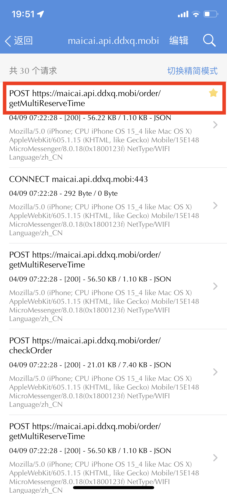
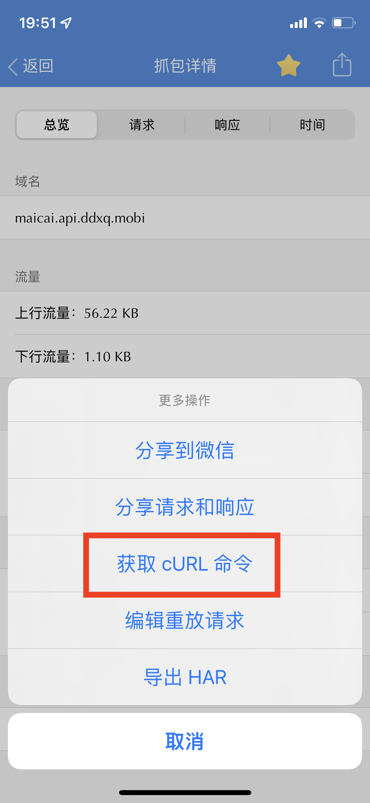
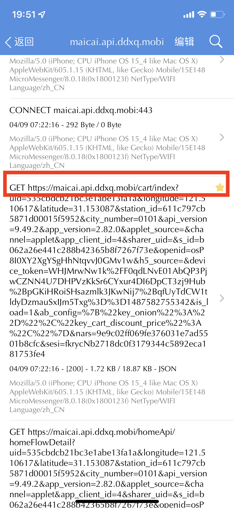
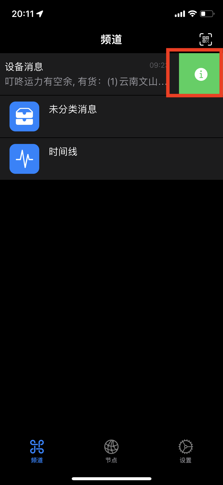
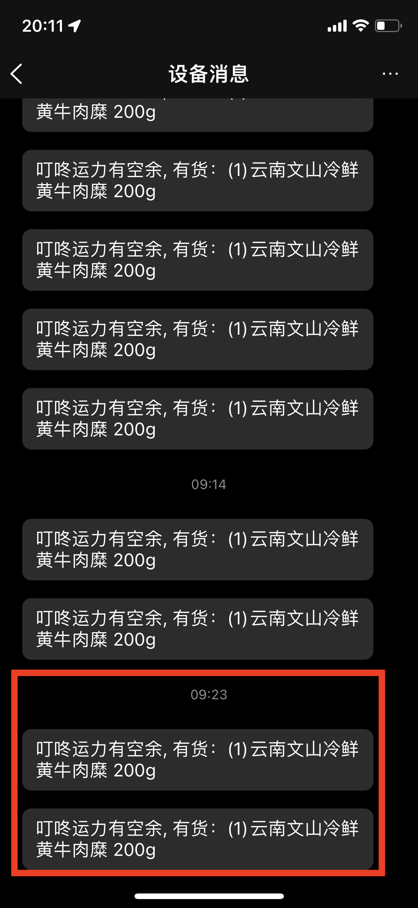

# DingDong-Robot
叮咚买菜抢菜机器人

## 原理：
1. 通过Steam App抓包，获取叮咚买菜运力和购物车的接口
2. 通过脚本监控叮咚买菜相应站点的运力和购物车
3. 当有货、有运力的时候通过chanify App把消息推送到手机上
4. 马上跳起来，一键下单，你可以买到菜了

## 设置和使用方法

### 用Steam抓包，获取叮咚买菜运力和购物车接口
1. 下载Steam App，高级用户也可以用其他抓包工具，做好各种设置，不啰嗦了，不会的自己在百度一下。
2. 在Steam上启动抓包，然后用微信小程序打开叮咚买菜（不要用叮咚App），点击到购物车，然后再选择一下配送时间。

3. 从Steam历史抓包里面，获取运力接口（getMultiReserveTime）和 购物车接口（cart），如下图：

### 安装chanify，获取推送token，这样用手机实时推送了
1. 获取chanify token

2. 复制chanify token，拷贝到代码里面

### 设置dingdong_robot.pl，设置curl和token的参数
1. $curl_string = "TODO:复制getMultiReserveTime CURL链接";
2. $curl_cart_string = "TODO:复制cart购物车的 CURL链接";
3. $token = "TODO: 复制chanify token";

### 运行脚本
perl dingdong_robot.pl

### 等风来，就可以买到菜了
1. 推送来了！！

2. 菜抢到了！！

